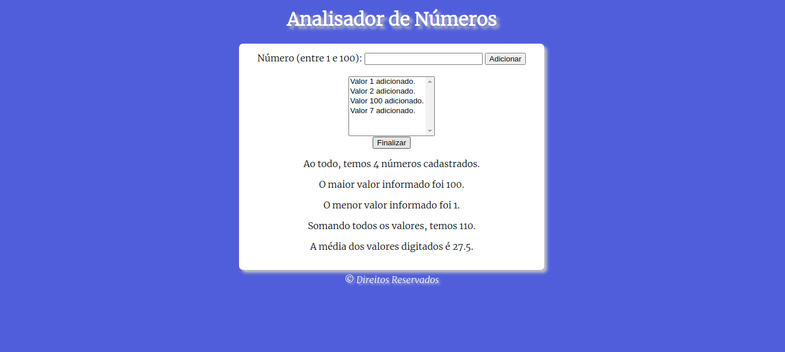

# Contagem Avançada

Projeto feito através do curso de JS do Canal Curso em Vìdeo.

[Link Para Playlist](https://www.youtube.com/playlist?list=PLHz_AreHm4dlsK3Nr9GVvXCbpQyHQl1o1)

Usando Array em JS para criar uma lista de números e obter informações deles, como soma, média e etc.

# Print

